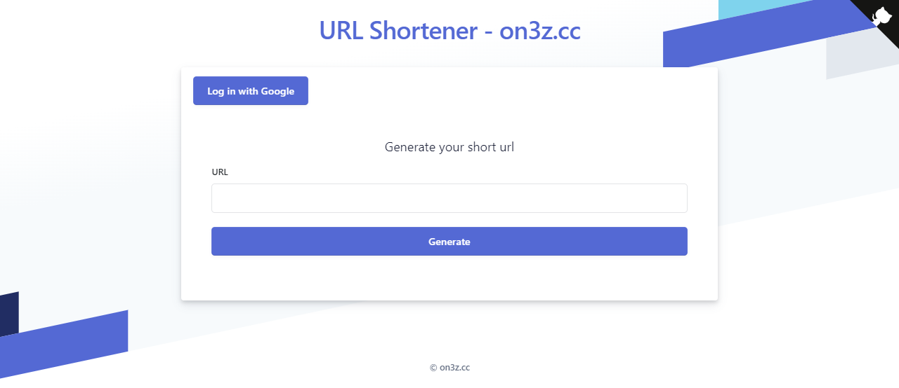
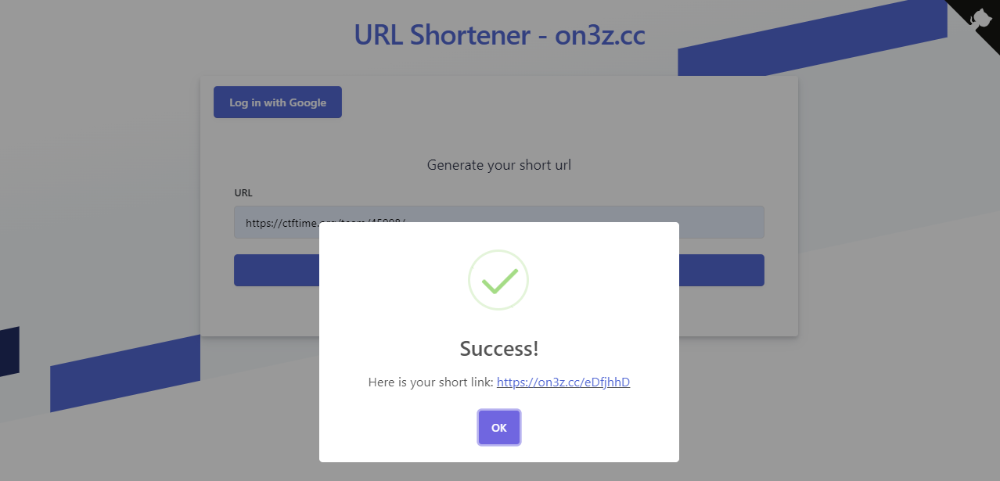
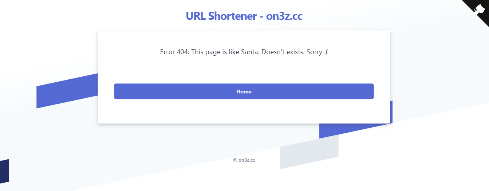
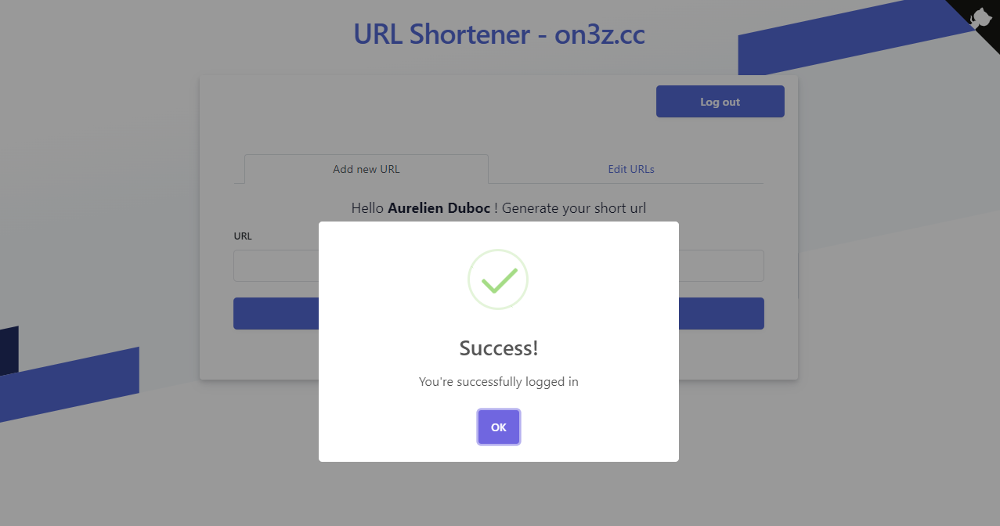
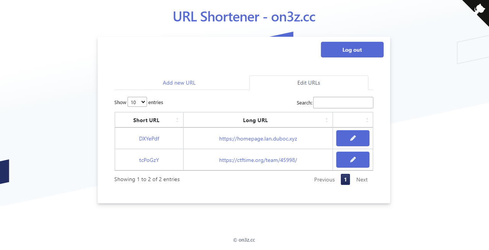
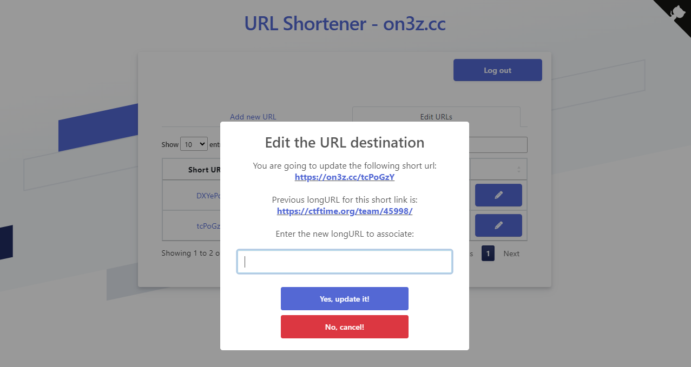
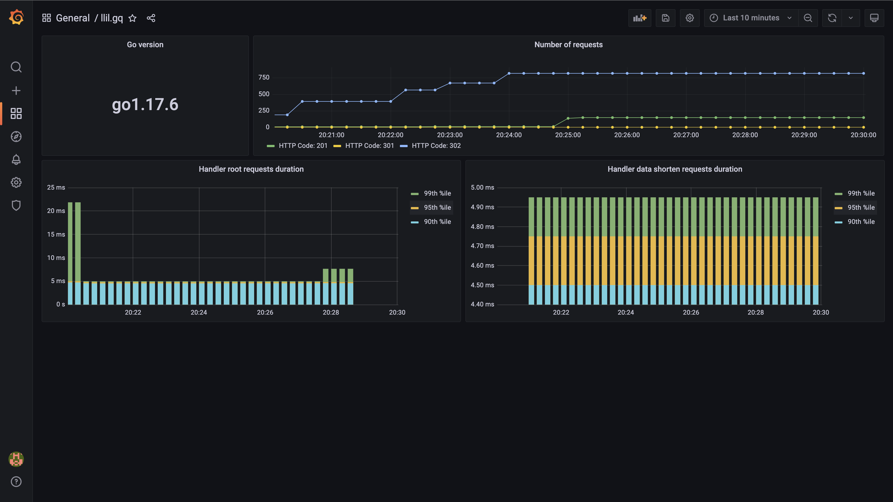

# on3z.cc

## Deployment

```bash
export POSTGRES_PASSWORD=...
docker-compose build --no-cache
docker-compose up -d
```

## Database

```bash
docker exec -it on3zcc_db_1 psql -U postgres -d docker -c "select * from short_url_maps;"
```

## Result

#### Homepage - [https://on3z.cc](https://on3z.cc)



#### Short link created (anonymous mode)



#### Check redirection

```bash
$ curl https://on3z.cc/eDfjhhD -v
...
< HTTP/1.1 301 Moved Permanently
< Server: nginx
< Date: Sun, 02 Jul 2023 06:40:13 GMT
< Content-Type: application/json; charset=UTF-8
< Content-Length: 0
< Connection: keep-alive
< Access-Control-Allow-Headers: Content-Type, Access-Control-Allow-Headers
< Access-Control-Allow-Methods: GET,OPTIONS
< Access-Control-Allow-Origin: *
< Cache-Control: no-cache, no-store, max-age=0, must-revalidate
< Location: https://ctftime.org/team/45998/
< Pragma: no-cache
<
* Connection #0 to host on3z.cc left intact

```

#### If short link does not exist



#### Connect with Google to edit short links






## Prometheus' metrics and Grafana dashboards

Reference:
[https://github.com/brancz/prometheus-example-app/](https://github.com/brancz/prometheus-example-app/)



## Misc

### Refences
 
- [https://ckinan.com/blog/auth0-simple-example-vanilla-js/](https://ckinan.com/blog/auth0-simple-example-vanilla-js/)
