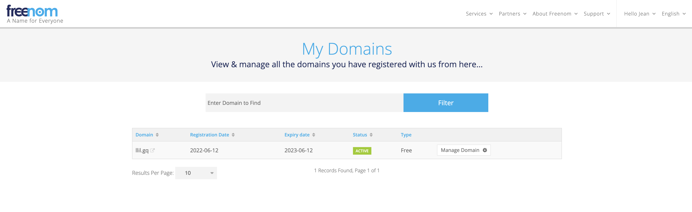
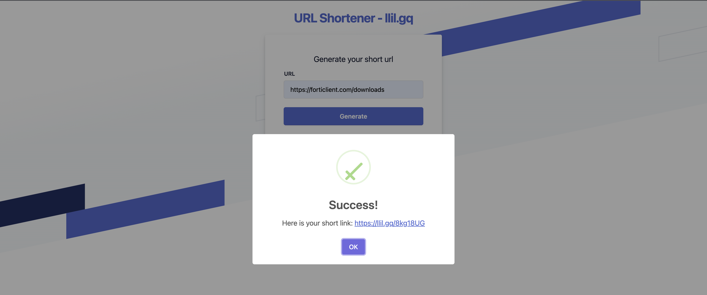

# llil.gq

## Register domain on freenom



## Deployment

```bash
export POSTGRES_PASSWORD=...
docker-compose build --no-cache
docker-compose up -d
```

## Database

```bash
docker exec -it llilgq_db_1 psql -U postgres -d docker -c "select * from short_url_maps;"
```

## Result

#### Homepage - [https://llil.gq](https://llil.gq)


#### Short link created



#### Check redirection

```bash
$ curl https://llil.gq/8kg18UG -v 
...
* Mark bundle as not supporting multiuse
< HTTP/1.1 301 Moved Permanently
< Server: nginx
< Date: Wed, 15 Jun 2022 13:19:45 GMT
< Content-Type: application/json; charset=UTF-8
< Content-Length: 0
< Connection: keep-alive
< Access-Control-Allow-Headers: Content-Type, Access-Control-Allow-Headers
< Access-Control-Allow-Methods: GET,OPTIONS
< Access-Control-Allow-Origin: *
< Location: https://forticlient.com/downloads
< 
* Connection #0 to host llil.gq left intact
```

#### If short link does not exist


